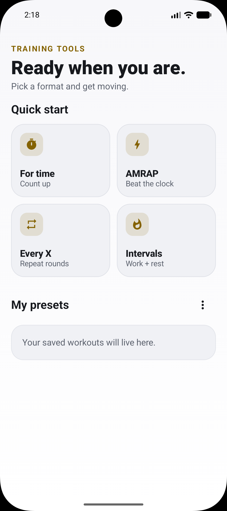
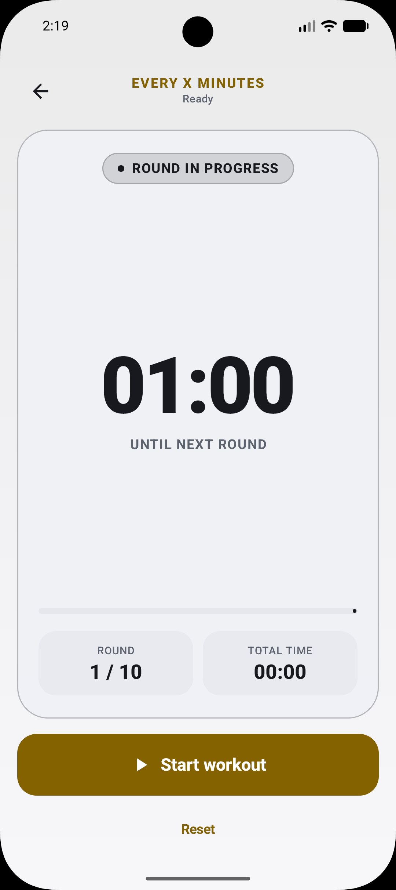

<p align="center">
  
</p>

<h1 align="center">WOD Timer</h1>

<p align="center">
  A focused, offline CrossFit and functional-fitness timer for Android.
</p>

<p align="center">
  <a href="https://github.com/xichen-de/wod-timer/actions/workflows/android-ci.yml"></a>
</p>

WOD Timer is a local Android timer for CrossFit and functional-fitness workouts. It supports For Time, AMRAP, Every-X-Minutes, and work/rest intervals, with reusable presets.

## Screenshots

<table>
  <tr>
    <td align="center"><strong>Quick start and presets</strong></td>
    <td align="center"><strong>Active workout</strong></td>
  </tr>
  <tr>
    <td></td>
    <td></td>
  </tr>
</table>

## What it supports

- For Time, AMRAP, Every X Minutes, and work/rest intervals
- Reusable presets with backup and restore
- Sound and vibration cues
- Pause, resume, reset, and background timing
- Automatic light and dark themes
- Fully offline operation with no accounts, ads, analytics, or network permission

## Developer setup

Open the project in Android Studio, let Gradle sync, and run the `app` configuration on an Android 8.0/API 26 or newer device or emulator.

To verify the project from a terminal:

```sh
./gradlew testDebugUnitTest lintDebug assembleDebug
```

Timing logic uses Android's monotonic clock and should be tested with explicit timestamps rather than real-time waits. When changing the Room database, increment its version, add a migration, and commit the updated schema from `app/schemas`.

## Built with

- Kotlin and Jetpack Compose with Material 3
- Room/SQLite local preset persistence
- Coroutines and StateFlow
- Foreground service for active workouts
- Custom PCM workout cues through Android `AudioTrack`

## Privacy

The app does not request internet access. Presets remain on the device and no usage data is collected.

## License

WOD Timer is available under the [MIT License](LICENSE).
